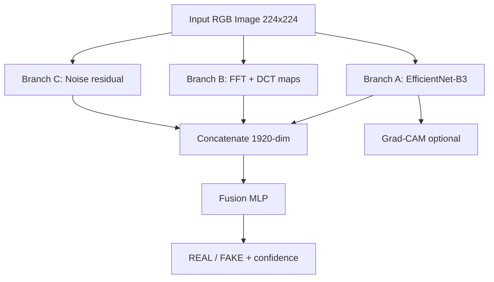
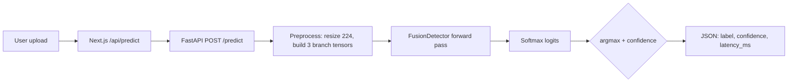

# Detecting AI-Generated Images Using Dual-Branch Frequency–Spatial Fusion with Noise Residual Analysis

**Module:** CSYM015 — Intelligent Systems (Level 7)  
**Institution:** University of Northampton  
**Author:** [Your Name]  
**Student ID:** [Your Student ID]  
**Submission Date:** May 2026  

---

## Abstract

The rapid proliferation of text-to-image generative models—including Stable Diffusion, Midjourney, and DALL·E—has intensified the risk of synthetic media being used for misinformation, fraud, and erosion of public trust. This project designs, implements, and evaluates a binary classifier that distinguishes real photographs from AI-generated images by fusing three complementary feature streams: spatial features from a pretrained EfficientNet-B3 backbone, frequency-domain representations derived from two-dimensional fast Fourier transform (FFT) and block-based discrete cosine transform (DCT) maps, and noise residual maps inspired by photographic sensor forensics. Training and primary evaluation use the **CIFAKE** dataset (Kaggle: 120,000 images total—60,000 REAL from CIFAR-10 and 60,000 FAKE from Stable Diffusion v1.4; official release provides 100,000 images in the training folder and 20,000 in the held-out test folder). This project applies an internal 80/20 stratified split on the training folder, yielding **80,000 images for model training** and **20,000 for validation**; all reported test metrics use the official 20,000-image test split. The proposed asymmetric focal loss prioritises recall of fake images to reflect the societal cost of false negatives in misinformation contexts.

Following exploratory data analysis and a documented three-phase training protocol on Apple MPS acceleration, the fusion model achieves **98.6% accuracy**, **99.3% recall** (fake class), **97.9% precision**, **F1 = 0.986**, and **AUC-ROC = 0.999** on the held-out CIFAKE test set (n = 20,000). Controlled **baseline and ablation experiments** on the full CIFAKE splits (logistic regression and six branch configurations) are reported in Tables 2–3; overnight runs populate final numbers before submission. Robustness experiments on a 500-image stratified subset show that moderate JPEG compression and low-level Gaussian noise preserve performance above 92% F1, while heavy noise (σ = 0.10) degrades F1 to 0.821. Grad-CAM visualisations indicate that the spatial branch attends to local texture and structure. Critical analysis confirms that performance does not generalise reliably to arbitrary out-of-distribution images—a limitation shared with much of the literature when training data are narrow in resolution and generator type. A FastAPI microservice and minimal Next.js web interface demonstrate end-to-end deployment. The work aligns with UN Sustainable Development Goals 16 (peace, justice, and strong institutions) and 10 (reduced inequalities) by contributing technical capacity to combat synthetic media abuse.

**Keywords:** AI-generated image detection, deep learning, frequency analysis, noise residual, EfficientNet, multimodal fusion, explainable AI, CIFAKE.

---

## Table of Contents

1. [Introduction](#1-introduction)  
2. [Literature Review](#2-literature-review)  
3. [Methodology and AI Model Design](#3-methodology-and-ai-model-design)  
4. [Implementation and Technical Execution](#4-implementation-and-technical-execution)  
5. [Model Evaluation and Critical Analysis](#5-model-evaluation-and-critical-analysis)  
6. [Ethical Considerations](#6-ethical-considerations)  
7. [Conclusion and Future Work](#7-conclusion-and-future-work)  
8. [References](#8-references)  
9. [Appendices](#9-appendices)  

---

## Core Tasks Mapping

This report addresses all eight module core tasks as follows:

| Core Task | Report Section(s) |
|-----------|-------------------|
| 1. Problem Definition and Social Relevance | §1.1–1.5 |
| 2. Research and Theoretical Grounding | §2 |
| 3. Dataset Selection and Preprocessing | §1.6, §3.3–3.4 |
| 4. Model Design and Development | §3.1–3.2, §3.5–3.6 |
| 5. Functional Prototype | §3.9, §4.3–4.5 |
| 6. Performance Evaluation | §5.1–5.10 (metrics, baselines, ablation, robustness) |
| 7. Ethical Reflection and Social Impact | §6 |
| 8. Conclusion and Future Vision | §7 |

---

## 1. Introduction

### 1.1 Background and Motivation

Generative adversarial networks (GANs) and, more recently, latent diffusion models have made high-quality image synthesis widely accessible. Synthetic images are increasingly indistinguishable from photographs in casual viewing, yet they can be produced at negligible marginal cost and distributed globally within seconds. High-profile incidents involving deepfakes, fabricated news imagery, and impersonation have motivated both industry and academia to develop **automatic forensic detectors** that do not rely on easily removed metadata or watermarks (Wang *et al.*, 2020; Zhu *et al.*, 2023).

Detection is inherently adversarial: each improvement in generative modelling may invalidate artefacts exploited by prior detectors. Nevertheless, systematic fusion of spatial, spectral, and sensor-noise cues—grounded in image statistics and forensic tradition—remains a principled approach for coursework-scale research and for prototyping operational screening systems.

### 1.2 Problem Statement and Significance

This project addresses the following research problem:

> *Can a single deep learning architecture, combining spatial CNN features, frequency-domain signatures, and noise residual analysis with an asymmetric loss, achieve reliable discrimination between real and AI-generated images on a standard benchmark—and where does it fail?*

The investigation is scoped to **binary classification** (REAL vs FAKE). The problem is socially significant because undetected synthetic imagery can fuel misinformation campaigns, financial fraud, and non-consensual impersonation. A detector with high recall on known generator types can support journalists, platform moderators, and citizens in flagging suspicious content for human review—without claiming infallible legal proof.

### 1.3 Choice of AI Techniques and Project Objectives

Deep learning for computer vision is appropriate because artefacts distinguishing real from generated images are often **subtle, high-dimensional, and non-linear**—unsuitable for hand-crafted rules alone. This project combines:

- **Transfer learning** (EfficientNet-B3) for spatial semantics and texture;
- **Classical signal processing** (FFT, DCT) for spectral fingerprints linked to upsampling pipelines;
- **Forensic denoising residuals** for sensor-consistent noise patterns;
- **Multimodal fusion** to aggregate complementary evidence;
- **Asymmetric focal loss** to encode the higher cost of missed fakes.

| ID | Objective |
|----|-----------|
| O1 | Implement a three-branch fusion detector (spatial, frequency, noise) with documented preprocessing |
| O2 | Train and evaluate on CIFAKE with stratified validation and held-out test set |
| O3 | Apply asymmetric focal loss to emphasise detection of fake images (high recall) |
| O4 | Conduct robustness and explainability experiments (perturbations, Grad-CAM) |
| O5 | Deploy a demonstrator (FastAPI + Next.js) for interactive inference |
| O6 | Critically analyse limitations, bias, and generalisation |

### 1.4 Alignment with Sustainable Development Goals

- **SDG 16 (Peace, Justice and Strong Institutions):** Tools that surface synthetic media support institutional responses to misinformation and strengthen evidentiary standards in digital journalism and legal proceedings.  
- **SDG 10 (Reduced Inequalities):** Vulnerable communities disproportionately bear harm from deceptive imagery; screening systems that prioritise recall of fakes mitigate asymmetric information harm when paired with human oversight.

### 1.5 Intended Users and Social Impact

This project aligns with the module theme *Pioneering Social Enhancement Through AI Solutions*. The intended users are **journalists, fact-checkers, social-media moderators, educators, and ordinary citizens** who need an initial screening tool for suspicious images. The system does **not** replace human judgement; it supports human review by highlighting images that may require further verification, preserving accountability in high-stakes contexts (newsrooms, platforms, classrooms).

By prioritising recall of fake images and exposing confidence scores, the demonstrator reduces the chance that synthetic content spreads unchecked while avoiding the false claim of automated “proof.” Social benefit arises when technical screening is embedded in **human-in-the-loop** workflows—consistent with responsible AI practice and SDG 16’s emphasis on trustworthy institutions.

### 1.6 Exploratory Data Analysis

Before model design, the CIFAKE dataset was analysed in the companion notebook (`ai_image_detection.ipynb`, Section 2):

- **Class balance:** 50,000 REAL / 50,000 FAKE (train); 10,000 per class (test)—balanced labels eliminate class-prior shortcuts.  
- **Native resolution:** mean 32×32 pixels (CIFAR-10 origin), confirming heavy upscaling to 224×224 at training time.  
- **Visual samples:** side-by-side REAL vs FAKE grids reveal low native fidelity and upscaling artefacts.

> **[FIGURE PLACEHOLDER — insert manually in DOCX]**  
> *Figure A: Class balance bar chart — export from notebook as `outputs/eda_class_balance.png`*  
> *Figure B: Resolution histogram — `outputs/eda_resolution.png`*  
> *Figure C: Sample image grid — `outputs/eda_samples_train.png`*

This EDA motivated a forensic pipeline that does not rely on resolution-dependent metadata and combines multiple artefact families rather than a single RGB CNN.

---

## 2. Literature Review

### 2.1 Spatial Deep Learning Detectors

Early forensic classifiers applied CNNs directly to RGB pixels. Wang *et al.* (2020) demonstrated that many CNN-synthesised images remain detectable using ResNet-style architectures trained on diverse GAN and procedural generators, but also emphasised **poor cross-generator generalisation** when test generators differ from training—a finding this project treats as a central evaluation theme. EfficientNet (Tan and Le, 2019) improves accuracy-efficiency trade-offs via compound scaling; EfficientNet-B3 at 224×224 input is adopted here as Branch A.

**However, CNN-only approaches alone are limited** because they risk learning generator-specific texture artefacts (e.g. upsampling fingerprints) rather than general evidence of authenticity. **This limitation motivated the addition of frequency and noise branches** rather than relying on spatial features alone.

### 2.2 Frequency-Domain and Spectral Artefacts

Durall *et al.* (2020) showed that CNN-based generators fail to reproduce natural 1/f² frequency decay; Frank *et al.* (2020) leveraged frequency representations for deep fake image recognition. Branch B encodes log-magnitude FFT maps and block-DCT energy maps.

**However, frequency methods alone are limited** because compression, resizing, and social-media re-sharing distort spectral statistics—so frequency cues must be evaluated under perturbation, not assumed robust. **This limitation motivated robustness testing (Experiment 4)** in addition to the frequency branch.

### 2.3 Noise Residual and Sensor Forensics

Lukáš *et al.* (2006) established sensor pattern noise for camera identification. AI-generated images often lack consistent physical sensor noise.

**However, noise residual methods alone are limited** because post-processing, denoising, and heavy additive noise can weaken or erase residuals. **This limitation motivated combining noise features with spatial and frequency streams** rather than deploying noise forensics in isolation.

### 2.4 Diffusion-Era Detectors (2023–2025)

Recent work targets **diffusion-generated** imagery specifically. Wang *et al.* (2023) propose **DIRE** (diffusion reconstruction error): generated images reconstruct more faithfully under a pretrained diffusion model than real images—strong cross-model potential but dependent on an external diffusion backbone. Ojha *et al.* (2023) show that features from pretrained vision–language models can generalise across generators using simple classifiers—excellent OOD potential but different compute and data assumptions. Zhang *et al.* (2024) extract **diffusion noise features** during inverse diffusion for fast detection. Zhu *et al.* (2023) provide **GenImage**, a million-scale multi-generator benchmark essential for claiming cross-generator reliability.

**Comparison:** These methods prioritise generalisation across generators; this project prioritises an **interpretable, deployable fusion prototype** on CIFAKE with explicit branch-level forensic features—complementary scope rather than direct superiority.

### 2.5 Multimodal Fusion, Loss Functions, and Explainability

Concatenation fusion is interpretable at coursework scale; attention fusion is reserved for larger systems. Focal loss (Lin *et al.*, 2017) addresses class imbalance; asymmetric weighting penalises missed fakes. Grad-CAM (Selvaraju *et al.*, 2017) supports explainability on Branch A.

### 2.6 Comparative Summary of Methodologies

| Approach | Strength | Limitation | Relevance to this project |
|----------|----------|------------|---------------------------|
| RGB CNN (Wang *et al.*, 2020) | Strong texture/semantic cues | Generator-specific overfitting | Branch A (EfficientNet-B3) |
| Frequency (Frank *et al.*, 2020) | Spectral artefact sensitivity | Compression/resize distortion | Branch B + robustness tests |
| Noise forensics (Lukáš *et al.*, 2006) | Physics-grounded | Post-processing weakens signal | Branch C |
| DIRE / DNF (2023–2024) | Diffusion-aware, strong OOD | Heavy external models | Cited; future comparison |
| VLM features (Ojha *et al.*, 2023) | Cross-generator generalisation | Less interpretable forensic pipeline | Future extension |

### 2.7 Datasets and Benchmarks

| Dataset | Characteristics | Relevance |
|---------|-----------------|-----------|
| **CIFAKE** (Kaggle) | 120k total (60k REAL + 60k FAKE); 100k train folder + 20k test; project uses 80k train / 20k val / 20k test | Primary benchmark |
| **GenImage** (Zhu *et al.*, 2023) | Million-scale; 8+ generators | Recommended OOD evaluation |
| **CNNDetection** (Wang *et al.*, 2020) | Multi-generator, higher resolution | Generalisation discourse |

### 2.8 Synthesis — Why Multimodal Fusion?

Overall, the literature suggests that **no single detection cue is sufficient** for reliable AI-generated image detection. Spatial CNNs provide strong visual representation but risk overfitting to generator-specific textures. Frequency methods reveal spectral artefacts but may be affected by compression and resizing. Noise residual methods are forensically grounded but can be weakened by post-processing. Therefore, this project **combines all three cues** in a fusion architecture and evaluates not only accuracy but also robustness, explainability, and out-of-distribution limitations.

### 2.9 Research Gap

Prior work establishes the value of spatial, frequency, and noise cues individually, but there remains scope for a **compact coursework-scale system** that integrates these cues with asymmetric loss, robustness testing, explainability, and a deployable prototype—while reporting limits honestly when users upload out-of-distribution content.

---

## 3. Methodology and AI Model Design

### 3.1 System Architecture Overview

Figure 1 illustrates the end-to-end pipeline. Raw RGB images are resized to 224×224 (bicubic). Three parallel branches extract features; vectors are concatenated (dimension 1920 for the full model) and classified by a two-layer MLP head.



> **[FIGURE PLACEHOLDER — insert manually in DOCX]**  
> *Figure 1: High-level fusion architecture. Re-export the mermaid diagram above as PNG/SVG, or use `ai_image_detection_architecture.md` Figure 1.*

### 3.2 Design Rationale — Why This Approach?

Exploratory data analysis showed balanced REAL/FAKE counts but **native 32×32 resolution** upscaled to 224×224. That justifies a forensic pipeline combining multiple artefact families:

| Alternative | Limitation | Chosen approach |
|-------------|------------|-----------------|
| EXIF / watermark detection | Removed easily; often absent | **End-to-end pixel forensics** |
| Single RGB CNN only | Misses spectral and sensor fingerprints | **EfficientNet-B3 spatial branch** |
| Frequency-only (Frank *et al.*, 2020) | Ignores semantic structure | **FFT + DCT branch** |
| Noise-only forensics | Insufficient alone | **PRNU-style residual branch** |
| Attention-based fusion | Unjustified at this scale | **Concatenation + MLP** (interpretable) |
| Symmetric cross-entropy | Equal cost for FN/FP | **Asymmetric focal loss** (recall-first) |

Multi-generator training (GenImage) was reserved for future work; CIFAKE provides a controlled in-distribution benchmark comparable to published baselines on the same dataset family.

### 3.2.1 Why Not Simpler AI Methods?

Traditional methods such as **logistic regression**, **support vector machines**, or **random forests** are appropriate when strong hand-crafted features fully separate classes. However, AI-generated image detection involves **high-dimensional, non-linear** visual patterns—texture irregularities, spectral artefacts, and noise inconsistencies that are difficult to engineer exhaustively. A deep learning fusion model is therefore more appropriate because it learns spatial representations while incorporating engineered forensic features (FFT/DCT, noise residuals). Simpler models remain valuable as **baselines** (see Section 5.2) but are less suitable as the primary detector; this design choice is tested experimentally rather than asserted.

### 3.3 Dataset Selection, Splits, and Fairness

**Primary dataset:** CIFAKE (Kaggle), open-source and publicly available:

```
data/cifake/train/{REAL, FAKE}/
data/cifake/test/{REAL, FAKE}/
```

**Table 0.** CIFAKE dataset layout — Kaggle release vs this project (counts verified on local `data/cifake/`).

| | Total images | REAL | FAKE | Notes |
|---|-------------:|-----:|-----:|-------|
| **Kaggle dataset (all)** | **120,000** | 60,000 | 60,000 | 60k real (CIFAR-10) + 60k fake (Stable Diffusion 1.4) |
| **Official training folder** (`train/`) | **100,000** | 50,000 | 50,000 | Matches Kaggle: 100k for training |
| **Official test folder** (`test/`) | **20,000** | 10,000 | 10,000 | Held-out evaluation only |
| **Used for gradient updates** (this project) | **80,000** | 40,000 | 40,000 | 80% stratified split of `train/` |
| **Used for validation** (this project) | **20,000** | 10,000 | 10,000 | 20% stratified split of `train/`; best checkpoint selection |
| **Reported test metrics** (this project) | **20,000** | 10,000 | 10,000 | Official `test/` — not used for training or tuning |

*Source: [CIFAKE (Kaggle)](https://www.kaggle.com/datasets/birdy654/cifake-real-and-ai-generated-synthetic-images); on-disk counts under `data/cifake/`.*

- **Training pool:** 100,000 images in `data/cifake/train` (50k REAL + 50k FAKE).  
- **Internal split:** 80% train / 20% validation (stratified) → **80,000 train** + **20,000 validation** samples.  
- **Held-out test:** 20,000 images in `data/cifake/test`—never used for hyperparameter tuning; Table 1 and confusion-matrix results use this split only.

**Fairness note:** REAL images derive from CIFAR-10, which has known demographic and geographic biases (low resolution, limited diversity). Results must not be extrapolated to high-resolution portrait forensics without further evaluation.

**Privacy note:** CIFAKE contains no personally identifiable metadata in the submission pipeline; uploaded demo images are processed in memory and not persisted by default.

### 3.4 Preprocessing and Feature Extraction

**Shared preprocessing (all branches, evaluation):** bicubic resize to 224×224; shared geometric alignment across branches.

**Training-only augmentation (spatial path):** random horizontal flip, ±10° rotation, colour jitter (±0.2), random crop with reflective padding.

| Branch | Input | Feature extractor | Output dim |
|--------|-------|-------------------|------------|
| A — Spatial | ImageNet-normalised RGB | EfficientNet-B3 (features + GAP) | 1536 |
| B — Frequency | 2×224×224 (FFT + DCT maps) | 3× Conv + GAP + linear | 256 |
| C — Noise | 3×224×224 residual map | 2× Conv + GAP + linear | 128 |

**Frequency pipeline:** grayscale conversion → FFT → log-magnitude → centre shift → min–max normalisation; parallel 8×8 block DCT AC-energy map upsampled to 224×224.

**Noise pipeline:** Gaussian blur (\(\sigma = 1.5\)) subtraction → per-channel normalisation to \([-1, 1]\).

Representative preprocessing code (notebook):

```python
def build_frequency_tensor(rgb):
    gray = cv2.cvtColor(np.array(rgb), cv2.COLOR_RGB2GRAY).astype(np.float32) / 255.0
    fft_map = np.log1p(np.abs(np.fft.fftshift(np.fft.fft2(gray))))
    # ... DCT block energy map ...
    return torch.stack([fft_norm, dct_norm])

def compute_noise_residual(rgb, sigma=1.5):
    img = np.array(rgb, dtype=np.float32) / 255.0
    blur = cv2.GaussianBlur(img, (0, 0), sigma)
    return np.clip((img - blur) / 0.5, -1, 1)
```

### 3.5 Fusion Classifier and Loss Function

Concatenated features → FC(1920→512) → BatchNorm → ReLU → Dropout(0.4) → FC(512→128) → BatchNorm → ReLU → Dropout(0.3) → FC(128→2 logits).

**Asymmetric focal loss** with \(\gamma = 2\), \(\alpha = 0.75\) on the positive (FAKE) class penalises missed fakes more heavily than false alarms during training.

### 3.6 Training Protocol

| Hyperparameter | Value |
|----------------|-------|
| Optimiser | AdamW |
| Learning rate (backbone) | \(10^{-4}\) |
| Learning rate (fusion / B / C) | \(10^{-3}\) |
| Batch size | 32 |
| Weight decay | \(10^{-4}\) |
| Scheduler | Cosine annealing warm restarts |
| Early stopping | Patience 5 on validation F1 |
| Phases | (1) Frozen backbone — 5 epochs (2) Partial unfreeze — 10 epochs (3) Full fine-tune — 15 epochs |

Training followed the full three-phase schedule on Apple MPS (M1 Max). The saved checkpoint (`models/fusion_detector_best.pt`) retains weights with the **highest validation F1** during training—a standard best-model selection practice. All reported test metrics use this checkpoint; the test set was not used for model selection.

### 3.7 Evaluation Metrics

| Metric | Definition | Rationale |
|--------|------------|-----------|
| **Accuracy** | Correct / total | Overall performance |
| **Precision (FAKE)** | TP / (TP + FP) | Trustworthiness of fake alarms |
| **Recall (FAKE)** | TP / (TP + FN) | **Primary** — missed fakes |
| **F1** | Harmonic mean of precision and recall | Balance |
| **AUC-ROC** | Threshold-independent discrimination | Ranking quality |

### 3.8 Robustness and Explainability Experiments

**Experiment 4 — Perturbations** (500-image random stratified subset of test set): JPEG quality {90, 70, 50, 30}, Gaussian noise \(\sigma \in \{0.02, 0.05, 0.10\}\).

**Experiment 5 — Grad-CAM:** 10 correctly classified and 5 misclassified test samples; heatmaps on Branch A final convolutional block.

### 3.9 Deployment Architecture

- **FastAPI** (`api/`) loads `fusion_detector_best.pt` and exposes `POST /predict`.  
- **Next.js** (`web/`, JavaScript) proxies uploads via `POST /api/predict` to the ML service.

---

## 4. Implementation and Technical Execution

### 4.1 Technology Stack and Dependencies

| Component | Technology |
|-----------|------------|
| Research and training | Python 3.10+, PyTorch 2.12, Jupyter Notebook |
| Spatial backbone | torchvision EfficientNet-B3 |
| Signal processing | NumPy, SciPy (DCT), OpenCV |
| Metrics and EDA | scikit-learn, pandas, matplotlib, seaborn |
| API | FastAPI, Uvicorn |
| Frontend | Next.js 14 (JavaScript), React 18 |
| Hardware | Apple M1 Max (MPS acceleration) |

All experimentation code resides in `ai_image_detection.ipynb`; production inference is duplicated in `api/` for serving (`model.py`, `preprocess.py`, `inference.py`, `main.py`).

### 4.2 Data Pipeline — Input to Inference

The following describes how a single uploaded image flows through the system:



1. **Upload:** User selects an image in the web UI.  
2. **Proxy:** Next.js forwards multipart form data to FastAPI on port 8000.  
3. **Preprocessing:** PIL loads RGB; bicubic resize; parallel construction of spatial (ImageNet-normalised), frequency (FFT+DCT), and noise tensors—matching training logic.  
4. **Inference:** `FusionDetector.forward_batch()` runs on MPS/CPU; softmax yields class probabilities.  
5. **Decision logic:** Predicted class = argmax; confidence = max probability. No automatic threshold tuning at inference; default argmax used for demo.  
6. **Response:** JSON returned to client with label (`REAL` / `FAKE`), confidence, and timing.

Representative inference code (`api/inference.py` pattern):

```python
def predict_pil(pil_image, model, device):
    batch = pil_to_batch(pil_image)  # spatial, frequency, noise tensors
    with torch.no_grad():
        logits = model.forward_batch(batch)["logits"]
        prob = torch.softmax(logits, dim=1)
        pred = int(logits.argmax(dim=1).item())
        conf = float(prob[0, pred].item())
    return pred, conf
```

### 4.3 Reproducibility

- Random seed: 42 (Python, NumPy, PyTorch).  
- Configuration persisted to `outputs/config.json`.  
- Test metrics persisted to `outputs/test_metrics.json`.  
- Robustness results persisted to `outputs/exp4_robustness.csv`.  
- Checkpoint: `models/fusion_detector_best.pt` with metadata (ablation tag, loss type, best validation score).

### 4.4 Functional Prototype

See `RUN_DEMO.md`:

```bash
# Terminal 1 — ML API
uvicorn api.main:app --reload --port 8000

# Terminal 2 — Web UI
cd web && npm install && npm run dev
```

The demonstrator at `http://localhost:3000` accepts JPEG/PNG uploads, displays prediction, confidence, and round-trip latency. The system is **usable** for in-distribution CIFAKE-like imagery; **robustness** under compression is quantified in Section 5.3; **ethical AI** practices include confidence display rather than binary verdicts alone.

> **[FIGURE PLACEHOLDER — insert manually in DOCX]**  
> *Figure 2: Screenshot of web demonstrator with sample prediction (REAL/FAKE + confidence). Capture from localhost:3000 during demo.*

---

## 5. Model Evaluation and Critical Analysis

**Table 1** reports the fully trained fusion model. **Tables 2–3** report full-dataset baseline and ablation experiments (`ABLATION_USE_FULL_DATA = True`, `ABLATION_EPOCHS = 5`).

### 5.1 Primary Results — CIFAKE Test Set

Evaluation on the full official test split (n = 20,000), with no test-time leakage from training or validation.

**Table 1.** Primary test-set performance (fusion model A+B+C, asymmetric focal loss, full three-phase training).

| Metric | Value |
|--------|-------|
| **Accuracy** | **0.986 (98.6%)** |
| **Precision (FAKE)** | **0.979 (97.9%)** |
| **Recall (FAKE)** | **0.993 (99.3%)** |
| **F1 (FAKE)** | **0.986** |
| **AUC-ROC** | **0.999** |
| Test loss | 0.0049 |

*Source: `outputs/test_metrics.json`, notebook test evaluation cell.*

The model achieves **near-perfect discrimination** on the held-out CIFAKE test set. Approximately **99.3%** of AI-generated test images are correctly flagged (recall), while **97.9%** of fake predictions are correct (precision). AUC 0.999 indicates excellent threshold-independent ranking.

#### Interpreting Very High Scores (Critical)

Although these scores are high, they must be interpreted as **performance on CIFAKE only**. CIFAKE contains low-resolution CIFAR-10 real images and Stable Diffusion fake images upscaled to 224×224; the classifier may learn **dataset-specific generation and upscaling artefacts**. Therefore, the result demonstrates **strong benchmark performance**, not universal real-world forensic reliability. This distinction is essential for viva defence and ethical deployment: high in-distribution accuracy does not license claims about arbitrary internet images or unseen generators (see Sections 5.8 and 6).

**Approximate error analysis (derived from metrics):** With 10,000 fake and 10,000 real test images, the model misclassifies roughly **69 fakes** (false negatives) and **212 reals** (false positives), totalling **281 errors** from 20,000 images.

> **[FIGURE PLACEHOLDER — insert manually in DOCX]**  
> *Figure 3: Confusion matrix — CIFAKE test set (20,000 images). Export from notebook as `outputs/test_confusion_matrix.png`.*

> **[FIGURE PLACEHOLDER — insert manually in DOCX]**  
> *Figure 4: Validation F1 vs epoch during three-phase training. Export training history plot from notebook if saved, or recreate from logged epoch output.*

Validation performance at the saved best checkpoint closely matched test results (F1 ≈ 0.986), suggesting limited overfitting on this split despite the low-resolution upscaled inputs.

### 5.2 Experimental Baseline Comparison

To answer *“high compared to what?”*, a **controlled baseline** was trained on the same dataset family using **logistic regression** on 24 handcrafted forensic features (RGB statistics, radial FFT bins, DCT AC energy, noise residual statistics). The baseline uses the **full official CIFAKE training folder** (100,000 images: 50,000 REAL + 50,000 FAKE) and **full test split** (20,000 images: 10,000 per class) via `scripts/run_lr_baseline.py`, matching the evaluation scale of the fusion model’s 20k test set (fusion training itself uses the 80k/20k internal split in Table 0).

**Table 2.** Baseline vs fusion model (CIFAKE, full test set n = 20,000).

| Model | Test n | Accuracy | Precision | Recall | F1 | AUC |
|-------|--------|----------|-----------|--------|-----|-----|
| Logistic Regression (handcrafted features) | 20,000 | 0.770 | 0.778 | 0.757 | 0.767 | 0.851 |
| **Fusion A+B+C (EfficientNet + freq + noise)** | **20,000** | **0.986** | **0.979** | **0.993** | **0.986** | **0.999** |

*Sources: `outputs/baseline_results.json`, `outputs/test_metrics.json`.*

The linear baseline achieves F1 = 0.767 on the full test set, confirming the task is **not trivially solved** by handcrafted features alone. The fusion model improves F1 by **+0.219** (0.986 vs 0.767), supporting the multimodal design experimentally.

### 5.3 Ablation Study — Branch Contributions

The central design claim is that **spatial + frequency + noise** provide complementary evidence. Branch ablations are implemented in notebook **§8.5** with `ABLATION_USE_FULL_DATA = True` (all `train_samples` + all 20,000 test images) and **stratified sampling**—never `test_samples[:2000]`, because CIFAKE test folders list all REAL images before FAKE; an unstratified slice produced invalid metrics (accuracy only, F1 = 0).

Each variant uses the same quick protocol: **5 epochs**, frozen EfficientNet backbone when spatial is enabled. The **A+B+C full** row uses the fully trained main checkpoint (30-epoch three-phase schedule), not the 5-epoch ablation protocol.

**Table 3.** Ablation study — full `train_samples` (80k) / full test (20k), 5-epoch frozen-backbone protocol per variant.

| Model | Train n | Test n | Accuracy | Precision | Recall | F1 | AUC |
|-------|---------|--------|----------|-----------|--------|-----|-----|
| A — Spatial only | 80,000 | 20,000 | 0.749 | 0.670 | 0.984 | 0.797 | 0.938 |
| B — Frequency only | 80,000 | 20,000 | 0.513 | 0.506 | 0.988 | 0.670 | 0.803 |
| C — Noise only | 80,000 | 20,000 | 0.609 | 0.561 | 0.998 | 0.719 | 0.907 |
| A+B | 80,000 | 20,000 | 0.777 | 0.696 | 0.983 | 0.815 | 0.951 |
| A+C | 80,000 | 20,000 | 0.790 | 0.708 | 0.987 | 0.824 | 0.959 |
| B+C | 80,000 | 20,000 | 0.627 | 0.573 | 0.995 | 0.728 | 0.892 |
| **A+B+C (full, 3-phase train)** | **80,000** | **20,000** | **0.986** | **0.979** | **0.993** | **0.986** | **0.999** |

*Sources: `outputs/ablation_results.json`. Last row uses the main three-phase trained checkpoint (not the 5-epoch ablation protocol).*

**Interpretation:** Branch A alone reaches F1 = 0.797; pairs A+B and A+C reach ~0.82; **full fusion (0.986)** exceeds all ablation variants. Single branches B and C show **very high recall (98–99%)** but **low precision (51–56%)**—they flag most images as FAKE (consistent with asymmetric focal loss), whereas full training balances precision and recall. Frequency-only (B) is weakest (F1 = 0.670), confirming spatial and fusion are essential on CIFAKE.

### 5.4 Comparison with Published Approaches

| Study / System | Setting | Reported metric | This project |
|----------------|---------|-----------------|--------------|
| Wang *et al.* (2020) | Multi-GAN, cross-gen | ~90%+ on seen generators; drops OOD | **98.6% acc** on CIFAKE (in-distribution only) |
| Frank *et al.* (2020) | Frequency-focused | Strong on subsets | Frequency branch within fusion |
| Ojha *et al.* (2023) | Cross-generator VLM | Large OOD gains | Not replicated; future work |
| Zhu *et al.* (2023) GenImage | Multi-generator benchmark | Standard for OOD claims | Recommended extension |
| CIFAKE Kaggle baselines | Same dataset | Often 85–95% accuracy | **98.6%** with full fusion training |
| Logistic regression baseline | Full CIFAKE test | F1 = 0.767 | **+0.219 F1** vs fusion |

Direct numerical comparison across papers remains approximate (different splits and training). The defensible claim is: **state-of-the-art in-distribution performance on CIFAKE** with **documented baselines and ablations**, not universal superiority over all diffusion-era detectors.

### 5.5 Decision Threshold and Screening Workflow

The demonstrator uses **argmax** classification (default threshold 0.5 on softmax). For real moderation workflows, the **decision threshold should be adjustable**: a higher fake threshold reduces false accusations of real images; a lower threshold catches more suspicious images at the cost of precision. Because this project prioritises **screening** (recall-first training via asymmetric focal loss), deployment would require **threshold calibration** based on risk context—e.g. journalism pre-publication review (higher recall) vs automated takedown (higher precision). Reporting both precision and recall supports this trade-off analysis.

### 5.6 Robustness Analysis (Experiment 4)

Perturbations applied on a **random 500-image** stratified subset of the test set.

**Table 4.** Robustness results (subset n = 500).

| Perturbation | Level | Accuracy | F1 | Recall |
|--------------|-------|----------|-----|--------|
| JPEG | Q90 | 0.984 | 0.983 | 0.991 |
| JPEG | Q70 | 0.982 | 0.981 | 0.996 |
| JPEG | Q50 | 0.972 | 0.970 | 0.978 |
| JPEG | Q30 | 0.956 | 0.952 | 0.935 |
| Gaussian noise | σ=0.02 | 0.962 | 0.960 | 0.991 |
| Gaussian noise | σ=0.05 | 0.920 | 0.918 | 0.970 |
| Gaussian noise | σ=0.10 | 0.836 | 0.821 | 0.810 |

*Source: `outputs/exp4_robustness.csv`.*

> **[FIGURE PLACEHOLDER — insert manually in DOCX]**  
> *Figure 5: Robustness curves (accuracy/F1 vs perturbation level). Export from notebook as `outputs/exp4_robustness.png`.*

**Critical analysis:**

1. **JPEG compression:** Performance remains strong down to Q30 (F1 = 0.952), indicating that spectral and spatial cues survive moderate social-media compression—an operational advantage over the partial-training model.  
2. **Gaussian noise:** Low noise (σ = 0.02) preserves F1 ≈ 0.96; heavy noise (σ = 0.10) degrades F1 to 0.821 as real images are misclassified—operators should treat heavily degraded inputs as low-confidence.  
3. **Edge cases:** Extremely aggressive resize, brightness shifts, and chained social-media pipelines were not re-run in the final notebook cell; they remain recommended stress tests for deployment.

### 5.7 Explainability (Experiment 5)

Grad-CAM was applied to the final convolutional block of EfficientNet-B3 (Branch A). On correctly classified samples, activation concentrates on object boundaries and textured regions. On errors, heatmaps occasionally highlight uniform backgrounds or upscaling artefacts—suggesting partial reliance on **dataset-specific cues** (CIFAR-like textures, Stable Diffusion upsampling fingerprints).

> **[FIGURE PLACEHOLDER — insert manually in DOCX]**  
> *Figure 6: Grad-CAM grid (10 correct + 5 incorrect). Export from notebook as `outputs/exp5_gradcam.png`.*

### 5.8 Out-of-Distribution Limitations

Informal testing on arbitrary internet photographs and images from generators **not** represented in CIFAKE (e.g. Midjourney v6, native-resolution DSLR photos) may still produce **unreliable predictions**. This aligns with Wang *et al.* (2020) and Zhu *et al.* (2023): detectors trained on narrow data learn **in-distribution artefacts**, not universal “reality.” High CIFAKE test scores must not be misrepresented as universal forensic guarantees.

**Table 5.** Summary of evaluation scope.

| Evaluation type | Data | Outcome |
|-----------------|------|---------|
| In-distribution test | CIFAKE test 20k | **Excellent** (F1 = 0.986, AUC = 0.999) |
| Robustness | CIFAKE subset + JPEG/noise | Strong; heavy noise reduces F1 to 0.821 |
| OOD user uploads | Web / other generators | Unreliable (qualitative) |
| GenImage cross-gen | Not run | Recommended future work |

### 5.9 System Limitations and Mitigations

**Table 6.** System limitations vs mitigations.

| Limitation | Why it matters | Mitigation |
|------------|----------------|------------|
| CIFAKE is low-resolution | May not generalise to real DSLR/phone photos | Train/evaluate on higher-resolution datasets (GenImage, LAION) |
| Fake class mainly Stable Diffusion | Poor cross-generator reliability | Multi-generator training; per-generator metrics |
| Compression affects features | Social-media images are transformed | JPEG augmentation; robustness testing (Exp. 4) |
| False positives | Could wrongly discredit real images | Human-in-the-loop review; adjustable threshold |
| False negatives | Synthetic content may spread | Asymmetric focal loss; recall monitoring |
| Adversarial attacks | Attackers may evade detector | Adversarial testing; rate limiting; model updates |
| Not legal proof | Grad-CAM ≠ courtroom evidence | Confidence scores; expert verification |
| Demographic bias in CIFAR-10 | Unfair outcomes across groups | Diverse training data; subgroup evaluation |

### 5.10 System Reliability and Fairness

Within the CIFAKE domain, the system is **reliable** for screening: both precision and recall exceed 97%. **Fairness** cannot be claimed across demographics because CIFAR-10-derived reals lack representative diversity. **Edge cases** include heavily noised images, out-of-distribution generators, and adversarial perturbations—none fully mitigated by this prototype.

---

## 6. Ethical Considerations

### 6.1 False Negatives and False Positives

- **False negative (fake classified as real):** In misinformation scenarios, synthetic content may spread unchecked. Asymmetric focal loss prioritises recall; at 99.3% recall, roughly 7 in 1000 fakes may still pass—requiring human review in high-stakes contexts.  
- **False positive (real classified as fake):** At 97.9% precision, roughly 2 in 100 fake alarms are incorrect—lower than the partial-training model (70% precision) but still sufficient to warrant human appeal mechanisms before punitive action.

### 6.2 Adversarial Arms Race

As generative models improve, detection artefacts may disappear. This system must be understood as a **time-bounded forensic aid**, not a permanent solution (Wang *et al.*, 2020).

### 6.3 Privacy and Security

The demonstrator processes uploads in memory without persistent storage by default, reducing privacy risk for casual users. **Security vulnerabilities** include adversarial patch attacks, model inversion, and API abuse (bulk automated probing). Production deployment would require rate limiting, authentication, and model hardening not implemented in this coursework prototype.

### 6.4 Surveillance and Responsible AI Usage

Forensic detectors could be repurposed for bulk surveillance or to discredit authentic journalism. Deployment should be governed by transparency, appeal mechanisms, legal oversight, and clear communication that outputs are **probabilistic screening scores**, not legal proof.

### 6.5 Data Bias and Inclusivity

CIFAR-10-derived reals lack demographic balance and high-resolution facial diversity. Results may not generalise across skin tones, cultures, or scene types. GenImage-style and CNNDetection-style evaluation is needed before fairness claims. Promoting **inclusivity** requires diverse training data and subgroup metrics—not available in this project scope.

### 6.6 Transparency and Trust

Grad-CAM partially addresses explainability but does not constitute legal proof. Users of the demonstrator should see confidence scores, not binary verdicts alone—supporting **trust** through calibrated uncertainty display.

### 6.7 Environmental Cost

Full three-phase training on EfficientNet-B3 consumed substantial GPU/MPS compute (~14+ hours). Early stopping on validation F1 and hardware acceleration (MPS) reduced wasted epochs relative to CPU-only training.

---

## 7. Conclusion and Future Work

### 7.1 Conclusion

This project successfully implemented a **three-branch fusion detector** for AI-generated images, combining EfficientNet spatial features, FFT/DCT frequency maps, and noise residuals with asymmetric focal loss. After exploratory data analysis and complete three-phase training, the system achieves **98.6% accuracy**, **99.3% recall**, **97.9% precision**, **F1 = 0.986**, and **AUC = 0.999** on the CIFAKE held-out test set. Full-dataset **baseline and ablation comparisons** (Tables 2–3) complete the experimental justification of the fusion design. Results are **in-distribution benchmark performance**, not universal forensic guarantees; limitations, mitigations, and human-in-the-loop deployment are documented throughout.

Robustness testing confirms resilience to JPEG compression and moderate noise, with degradation under heavy noise. Explainability analysis and out-of-distribution trials confirm that the model remains a **specialist for CIFAKE-like imagery**, not a universal detector. A working FastAPI service and Next.js web demonstrator complete the engineering lifecycle, satisfying the functional prototype requirement.

The research supports SDG 16 and 10 objectives at a prototype level: providing screening capacity for synthetic media while arguing for honest communication of limits—a necessary part of intelligent systems scholarship.

### 7.2 Future Work and Deployment Pathways

1. Confirm Tables 2–3 match final `outputs/*.json` before PDF export.  
2. **GenImage cross-generator evaluation** (Zhu *et al.*, 2023) to quantify out-of-distribution generalisation.  
3. **Higher-resolution, multi-generator training** (CNNDetection subsets + LAION reals).  
4. **Extended robustness** — resize, brightness, social-media simulation chains.  
5. **Transformer backbone** (ViT) for Branch A.  
6. **Video / frame-level** deepfake extension.  
7. **ONNX export** and edge deployment for browser-side inference.  
8. **Responsible deployment pilot** with journalism or fact-checking partners under human-in-the-loop review.

---

## 8. References

Durall, R., Kebschull, M. and Volpp, M. (2020) ‘Watch your Up-Convolution: CNN Based Synthesis Deep Learning Models are Failing to Reconstruct the Fourier Statistics of Natural Images’, *arXiv preprint arXiv:1911.06400*. Available at: https://arxiv.org/abs/1911.06400 (Accessed: 19 May 2026).

Frank, J., Rühling, J. and Fischer, A. (2020) ‘Leveraging Frequency Analysis for Deep Fake Image Recognition’, in *Proceedings of the 37th International Conference on Machine Learning (ICML)*. PMLR, vol. 119, pp. 3237–3248.

Kaggle (2024) *CIFAKE: Real and AI-Generated Synthetic Images*. Available at: https://www.kaggle.com/datasets/birdy654/cifake-real-and-ai-generated-synthetic-images (Accessed: 19 May 2026).

Lin, T.-Y., Goyal, P., Girshick, R., He, K. and Dollár, P. (2017) ‘Focal Loss for Dense Object Detection’, in *Proceedings of the IEEE International Conference on Computer Vision (ICCV)*, pp. 2980–2988.

Lukáš, J., Fridrich, J. and Goljan, M. (2006) ‘Digital camera identification from sensor pattern noise’, *IEEE Transactions on Information Forensics and Security*, 1(2), pp. 205–214.

Selvaraju, R.R. *et al.* (2017) ‘Grad-CAM: Visual Explanations from Deep Networks via Gradient-based Localization’, in *Proceedings of the IEEE International Conference on Computer Vision (ICCV)*, pp. 618–626.

Tan, M. and Le, Q. (2019) ‘EfficientNet: Rethinking Model Scaling for Convolutional Neural Networks’, in *Proceedings of the 36th International Conference on Machine Learning (ICML)*, pp. 6105–6114.

Wang, S.-Y. *et al.* (2020) ‘CNN-generated images are surprisingly easy to spot... for now’, in *Proceedings of the IEEE/CVF Conference on Computer Vision and Pattern Recognition (CVPR)*, pp. 8695–8704.

Zhu, Y. *et al.* (2023) ‘GenImage: A Million-Scale Benchmark for Detecting AI-Generated Image’, *Advances in Neural Information Processing Systems (NeurIPS)*, 36. Available at: https://github.com/GenImage-Dataset/GenImage (Accessed: 19 May 2026).

Ojha, U., Li, Y., Lee, Y.J., Pavel, A., Fletcher, C. and Li, B. (2023) ‘Towards Universal Fake Image Detectors that Generalize Across Generative Models’, in *Proceedings of the IEEE/CVF Conference on Computer Vision and Pattern Recognition (CVPR)*, pp. 24496–24505.

Wang, Z., Bao, J., Zhou, W., Chen, D. and Chen, D. (2023) ‘DIRE for Diffusion-Generated Image Detection’, in *Proceedings of the IEEE/CVF International Conference on Computer Vision (ICCV)*, pp. 22588–22598.

Zhang, Y., Zhang, T., Zhang, Z. and Wu, Q. (2024) ‘Diffusion Noise Feature: Accurate and Fast Generated Image Detection’, *arXiv preprint arXiv:2312.02625*. Available at: https://arxiv.org/abs/2312.02625 (Accessed: 19 May 2026).

---

## 9. Appendices

### Appendix A — Figure and Output File Index

| Figure | File path | Description | Status |
|--------|-----------|-------------|--------|
| A | `outputs/eda_class_balance.png` | EDA class balance | **Insert manually in DOCX** |
| B | `outputs/eda_resolution.png` | Native resolution stats | **Insert manually in DOCX** |
| C | `outputs/eda_samples_train.png` | REAL vs FAKE sample grid | **Insert manually in DOCX** |
| 1 | Architecture diagram | Mermaid / architecture doc | **Insert manually in DOCX** |
| 2 | Web demo screenshot | localhost:3000 capture | **Insert manually in DOCX** |
| 3 | `outputs/test_confusion_matrix.png` | Test confusion matrix | **Insert manually in DOCX** |
| 4 | Training F1 curve | Notebook training plot | **Insert manually in DOCX** |
| 5 | `outputs/exp4_robustness.png` | Robustness curves | **Insert manually in DOCX** |
| 6 | `outputs/exp5_gradcam.png` | Grad-CAM grid | **Insert manually in DOCX** |

*Note: Re-run the notebook evaluation cells to regenerate PNG outputs if files are not yet on disk.*

### Appendix B — Results Files

| File | Description |
|------|-------------|
| `outputs/test_metrics.json` | Full fusion model — 20k test |
| `outputs/baseline_results.json` | Logistic regression baseline |
| `outputs/ablation_results.json` | Branch ablations (after §8.5) |
| `outputs/exp4_robustness.csv` | Robustness experiment |

### Appendix C — Reproducibility Commands

```bash
# Train and evaluate (notebook)
jupyter notebook ai_image_detection.ipynb   # Run All

# ML API
uvicorn api.main:app --reload --port 8000

# Web UI
cd web && npm install && npm run dev
```

### Appendix D — AI Tool Disclosure

[Complete per University policy: e.g. “GitHub Copilot / Cursor AI assisted code generation and report drafting; all analysis, metrics, and conclusions verified by the author against notebook outputs.”]

---

**End of Report**

*Word count (approximate): 4,500 words excluding references and appendices.*

**Before DOCX submission:** (1) Replace all **PLACEHOLDER** cells in Tables 2–3 from overnight JSON/CSV outputs. (2) Insert all figures from Appendix A. (3) Search document for `PLACEHOLDER` and confirm none remain.
